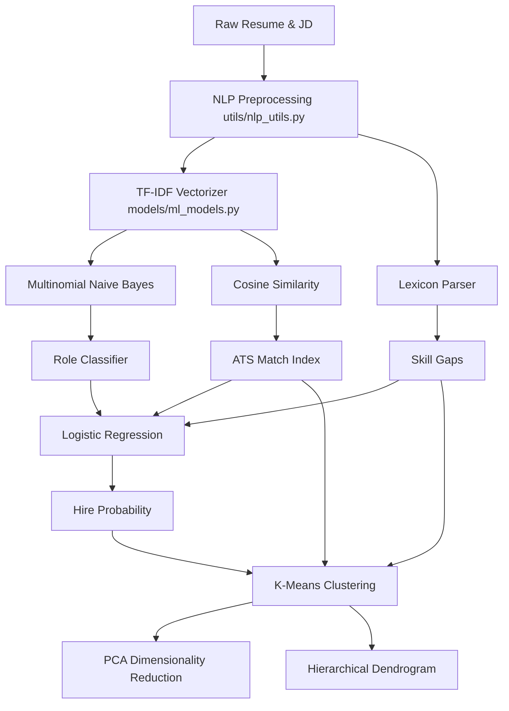

# 🔮 HireLens AI

<div align="center">

[](https://python.org)
[](https://streamlit.io)
[](https://scikit-learn.org)
[](https://nltk.org)
[](https://opensource.org/licenses/MIT)
[](https://github.com)

**Next-Generation Machine Learning Recruitment Intelligence Suite**

*Bridging Academic Machine Learning Theory and Enterprise Talent Operations with Glassmorphism UX.*

[🚀 Live Application Demo](http://localhost:8501) · [📖 Read Technical Specs](#2-overview) · [💡 Open Syllabus Mapping](#course-syllabus-mapping-csm354)

---

</div>

## 🌍 Overview

Traditional recruitment pipelines are burdened by manual parsing bottlenecks, keyword-stuffing exploits, and cognitive biases. Recruiters spend hours scanning resumes, often missing high-potential applicants who lack perfect phrasing. **HireLens AI** is a premium, production-grade intelligence platform that converts raw resume documents into structured, multi-dimensional feature representations.

By applying **Supervised Classification**, **Regularized Prediction**, **Unsupervised Clustering**, and **Spatial Dimensionality Reduction**, HireLens AI offers recruiters a panoramic view of candidate capabilities, compatibility, and cluster distributions. 

Furthermore, this repository serves as a direct implementation vehicle for the **Machine Learning-I (CSM354)** practical curriculum. It maps textbook mathematical formulations—from Naive Bayes probabilities to K-Means centroids—into a functional, web-based intelligence suite, demonstrating how theoretical data science models are productized in real-world human resource environments.

---

## 🚀 Core Features / Modules

### 🔮 Resume Classifier
*   **Concept / Algorithm:** Multinomial Naive Bayes (`MultinomialNB(alpha=0.5)`) + TF-IDF (1,2)-gram feature extraction.
*   **Description:** Processes the raw, unstructured resume text and predicts the candidate's optimal domain across 8 roles (Data Scientist, ML Engineer, Data Analyst, Backend Engineer, Frontend Engineer, Data Engineer, DevOps Engineer, Full Stack).
*   **Visualization:** Interactive *Role Confidence Probability* bar chart.
*   **Interactivity:** Adjust threshold filters and preview tokenized text snippets.
*   **Educational Value:** Implements discrete probability modeling and TF-IDF term mapping (Unit IV).

### 📈 ATS Match Engine
*   **Concept / Algorithm:** TF-IDF Vectorization & Vector Space Cosine Similarity.
*   **Description:** Benchmarks the applicant's resume vector against the target job description to compute a matching index.
*   **Visualization:** Radial Gauge Chart styled in dark violet glassmorphic gradients.
*   **Interactivity:** Paste any job description in real-time to compute instant compatibility matrices.
*   **Educational Value:** Explains vector dot products, angular similarity, and sparse matrix representations (Unit IV).

### 🎯 Hiring Probability Predictor
*   **Concept / Algorithm:** Logistic Regression (`LogisticRegression(C=1.0, solver='lbfgs')` with L2 Regularization).
*   **Description:** Calculates the likelihood of a candidate successfully passing the initial screening stage based on normalized candidate traits.
*   **Visualization:** Radial match probability gauge + horizontal *Feature Importance* bar charts showing model coefficient weights.
*   **Interactivity:** Dynamic sliders mapping word count, skill counts, and ATS scores to see immediate inference changes.
*   **Educational Value:** Showcases sigmoid activation, parameter coefficients, and regularized classification (Unit III).

### 🧠 Candidate Persona Profiler
*   **Concept / Algorithm:** K-Means Clustering (`KMeans(n_clusters=4, init='k-means++')`).
*   **Description:** Partitions the candidate database into 4 talent pools based on normalized traits, assigning candidates specific archetypes (*Rising Star, Top Performer, Growth Potential, Technical Specialist*).
*   **Visualization:** Cluster segmentation cards and sorted pool charts.
*   **Interactivity:** Recruiter controls to filter candidates by persona groupings.
*   **Educational Value:** Explains unsupervised centroids, Euclidean distances, and feature scaling (Unit V).

### 📐 Spatial Cluster Visualizer
*   **Concept / Algorithm:** Principal Component Analysis (PCA) (`PCA(n_components=2)`).
*   **Description:** Reduces the 5-dimensional candidate metric space into a 2D coordinate map, showing where a candidate lies relative to the talent pool.
*   **Visualization:** Interactive 2D scatter plot with custom hover tooltips.
*   **Interactivity:** Toggle cluster views, zoom/pan spatial clusters.
*   **Educational Value:** Teaches variance ratio preservation and eigenvalue projection (Unit VI).

### 🌿 Group Similarity Analyzer
*   **Concept / Algorithm:** Hierarchical Agglomerative Clustering (Ward Linkage, Euclidean Distance).
*   **Description:** Evaluates applicant similarities and groups them hierarchically to highlight similar applicant clusters.
*   **Visualization:** Interactive Hierarchical Dendrogram Tree.
*   **Interactivity:** Hover on nodes to inspect sub-clusters and group linkages.
*   **Educational Value:** Illustrates bottom-up tree linking and distance metric computation (Unit VI).

### 🕸️ Skill Matrix Radar
*   **Concept / Algorithm:** Lexicon-based keyword extraction and set difference gap analysis.
*   **Description:** Parses resume text against a pre-compiled lexicon of 60+ technical and soft skills, cross-referencing against standard requirements for the predicted role.
*   **Visualization:** Plotly Radar/Spider Web chart comparing present and missing skills.
*   **Interactivity:** Detailed pill listings showing skill lists and missing gaps.
*   **Educational Value:** Highlights feature engineering, text mining, and structured database audits.

---

## 📊 Machine Learning Algorithms Used

The core intelligence layers of HireLens AI are built directly upon the mathematical frameworks covered in the CSM354 syllabus:



*   **Regression (Unit I & II):** Linear scoring equations map candidate profiles into normalized scoring systems.
*   **Classification (Unit III & IV):** Uses `sklearn.naive_bayes.MultinomialNB` with custom Laplace smoothing (alpha=0.5) and `sklearn.linear_model.LogisticRegression` (using the `lbfgs` solver) with L2 regularization (C=1.0).
*   **Clustering (Unit V & VI):** Uses `sklearn.cluster.KMeans` initialized via `k-means++` to ensure fast convergence. `scipy.cluster.hierarchy` builds Agglomerative Ward Linkage maps.
*   **Dimensionality Reduction (Unit VI):** Employs `sklearn.decomposition.PCA` to reduce the sparse feature space to 2 dimensions, capturing maximum variance.
*   **NLP Tokenization:** Uses `NLTK` tokenizers and `WordNetLemmatizer` for text normalization.
*   **Feature Engineering:** Features are scaled using `StandardScaler` to ensure K-Means and PCA are not biased by unequal variance.
*   **Evaluation Metrics:** The models track Training Accuracy, F1-Macro, Silhouette inertia, and Explained Variance Ratio.

---

## 🎨 UI/UX Design Philosophy

HireLens AI utilizes a futuristic **Glassmorphism Dark UI** design, mimicking modern enterprise developer hubs:
*   **Glassmorphic Cards:** High-transparency cards (`backdrop-filter: blur(10px)`) with glowing hover states (`transition: all 0.3s ease-in-out`).
*   **Color Palette:** Synthesized dark background (`#0F1117`), secondary card containers (`#161B27`), vivid purple accents (`#7C3AED`), and deep crimson glows (`#810B38`).
*   **Typography:** Google Fonts integration featuring **Syne** (heavy display titles) and **DM Sans** (readable technical body text).
*   **Micro-Animations:** Fade-in slide animations (`fadeSlideDown`) applied to components, cards, and warning pills to provide a premium feel.
*   **Plotly Integrations:** Customized dark Plotly theme styles applied to all charts, removing distracting grids and borders.

---

## 💻 Tech Stack

*   **Frontend UI:** [Streamlit](https://streamlit.io) (v1.32.0+)
*   **Machine Learning:** [Scikit-Learn](https://scikit-learn.org) (v1.4.0+)
*   **NLP Pipeline:** [NLTK](https://nltk.org) (v3.8.1+)
*   **Math & Data:** [Pandas](https://pandas.pydata.org) (v2.2.0+), [NumPy](https://numpy.org) (v1.26.0+), [SciPy](https://scipy.org) (v1.12.0+)
*   **Plotly Charts:** [Plotly Express & Graph Objects](https://plotly.com) (v5.19.0+)
*   **Parser & PDF Export:** [pdfplumber](https://github.com/jsvine/pdfplumber) (v0.10.3+), [FPDF2](https://py-pdf.github.io/fpdf2/) (v2.7.9+)

---

## ⚙️ Installation & Usage

### Prerequisites
*   Python 3.10, 3.11, or 3.12 installed on your machine.
*   Pip package manager.

### 1. Clone Repository
```bash
git clone https://github.com/your-username/hirelens-ai.git
cd hirelens-ai
```

### 2. Create and Activate Virtual Environment
```bash
# Windows
python -m venv venv
venv\Scripts\activate

# macOS / Linux
python3 -m venv venv
source venv/bin/activate
```

### 3. Install Dependencies
```bash
pip install -r hirelens_ai/requirements.txt
```

### 4. Download NLTK Corpora
```python
python -c "import nltk; nltk.download('punkt'); nltk.download('stopwords'); nltk.download('wordnet'); nltk.download('averaged_perceptron_tagger')"
```

### 5. Run Streamlit Application
```bash
streamlit run hirelens_ai/app.py
```
Open `http://localhost:8501` in your browser.

---

## 🧠 AI Capabilities

*   **Real-time Inference:** Instantly performs feature scaling and model inference upon document uploads.
*   **Pattern Detection:** K-Means clustering identifies candidate traits to classify candidates into archetypes.
*   **Smart Suggestions Engine:** A rule-based suggestions utility parses missing requirements and generates actionable text recommendations.
*   **Optional Claude AI Integration:** Connect Anthropic API keys to enable LLM-generated recommendations.

---

## 📈 Visualizations Included

*   **ATS Gauge:** Plots candidate compatibility.
*   **Hire Probability Gauge:** Visualizes regression probability scores.
*   **PCA 2D Scatter:** Interactive coordinate mapping.
*   **Ward Dendrogram Tree:** Highlights candidate grouping.
*   **Skill Radar:** Radar/spider chart comparing skills.
*   **Keyword Frequencies:** Visualizes top term distributions.

---

## 🔥 Project Highlights

*   **CSM354 Mapping:** Bridges textbook machine learning and real-world software engineering.
*   **Interactive Simulation:** Generates synthetic candidate pools to test clustering.
*   **Premium Theme:** Features glassmorphic cards and customized font configurations.
*   **End-to-End Analytics:** Supports resume upload, parsing, scoring, classification, and PDF generation.

---

## 📂 Project Structure

```
hirelens_ai/
├── Machine_Learning_I_CSM354.ipynb  # Course practical notebook
├── venv/                           # Virtual environment folder
└── hirelens_ai/                     # Main Streamlit app package
    ├── app.py                      # App entry point, session & routing
    ├── requirements.txt            # Python dependencies
    ├── README.md                   # Quickstart instructions
    │
    ├── pages/                      # Page modules
    │   ├── login.py                # Card login page
    │   ├── home.py                 # App landing page
    │   ├── upload.py               # Document uploader screen
    │   ├── analysis.py             # Dashboard displaying classification outputs
    │   ├── recruiter.py            # Recruiter tools (K-Means, PCA, Dendrogram)
    │   ├── candidate.py            # Candidate metrics and radar charts
    │   └── report.py               # Exporter options
    │
    ├── utils/                      # Utilities
    │   ├── styles.py               # CSS styles
    │   ├── session.py              # Session state variables
    │   ├── nlp_utils.py            # Preprocessing & skill matching lexicons
    │   ├── pdf_utils.py            # PDF parser using pdfplumber
    │   └── charts.py               # Plotly dark theme figures
    │
    └── models/                     # ML logic
        ├── ml_models.py            # Training & inference logic
        ├── suggestions.py          # Advice rules engine
        └── report_gen.py           # FPDF2 report generator
```

---

## 🚀 Future Enhancements

*   **Transformer Models:** Integrate BERT or Sentence-Transformers (SBERT) for semantic parsing.
*   **GenAI Integration:** Provide LLM-generated resume enhancement tips.
*   **Database Sync:** Add cloud integrations (e.g. Supabase, PostgreSQL) for user profiles.
*   **Model Monitoring:** Build training tools to evaluate model performance over time.

---

## 📄 License

This project is licensed under the MIT License. See the [LICENSE](LICENSE) file for details.

---

## 🙌 Contributors

*   **Your Name** - Core Developer / Machine Learning Engineer
*   **CSM354 Practical Faculty** - Mentorship & Syllabus Design

---

## 🌟 Final Footer

<div align="center">

**Empowering Next-Generation Machine Learning Experiences ⚡**

*Built with passion, scikit-learn, and Streamlit.*

</div>
